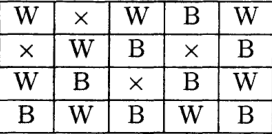
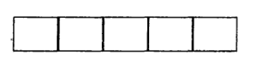

# Perfect Covers of Chessboard
考虑一个被分成了$8$行$8$列$64$个方格地棋盘。假设有大量形状相同地多米诺骨牌，它们正好覆盖棋盘的两个相邻方格。是否可以在棋盘上排列$32$个多米诺骨牌，使$2$个多米诺骨牌不重叠，每个多米诺骨牌覆盖$2$个方格，并且棋盘的所有方格都被覆盖？我们将这种排列称为多米诺骨牌对棋盘的完美覆盖或平铺。这是一个简单的排列问题，并且我们能很快想出很多不同的完美覆盖。数出最佳覆盖的数目是苦难的，但不是不可能的。这个数字由`Ficher`于1961年发现，为$12988816\times 2^4\times 17^2\times 53^2$。一般的棋盘可以被替换成$m$行$n$列有$mn$个方格的棋盘。现在可能不存在完美的覆盖。事实上，对于$3\times 3$的棋盘没有完美的覆盖。那么什么样的$m$和$n$的取值能有一个完美的覆盖呢？不难看出，当且仅当$m$和$n$中至少有一个偶数，或等价地，当且仅当棋盘的方格数是偶数时，一个$m\times n$的棋盘才会有一个完美的覆盖。`Fischer`已经推导出了$m\times n$棋盘不同完美覆盖个数的一般公式，其中包含三角函数。这个问题等价于于分子物理学中的一个著名问题，称为二聚体问题。它起源于双原子(二聚体)在表面吸附的研究。棋盘上的方块对应的是分子，而多米诺骨牌对应的是二聚体。

考虑有一个$8\times 8$的棋盘，用一个剪刀，切掉两个对角线相对的方块，剩下$62$个方块。是否有可能排列$31$个多米诺骨牌来找到一个这个修剪棋盘的完美覆盖。尽管这个修剪后的棋盘与$8\times 8$的棋盘非常相近，但是它并没有完美覆盖。这一点的证明是一个简单但聪明的组合推理的例子。在一个普通的$8\times 8$的棋盘上，方块都是交替涂为黑色和白色，有$32$个黑色和$32$个白色。如果我们切掉对角相对的两个方块，我们切除了两个颜色相同的方块，我们认为是白色。那么我们还剩$32$个黑色和$30$个白色。而每一个多米诺骨牌覆盖一个黑色和白色，所以修剪后的棋盘没有完美的覆盖。上述推理可以被概括为：
$$
31\operatorname{BW}\neq 32\operatorname{B} + 30\operatorname{W}
$$
更一般的情况是，我们可以拿一个$m\times n$的棋盘，它的方块被黑牌交替着色，然后任意剪下一些正方形，留下某种类型的被修剪过的棋盘。什么时候修剪过的棋盘有完美的覆盖。如果完美的覆盖存在，那么棋盘应该有相等的黑色和白色方块。但是这样还不够，正如下图所表示的：

因此，我们会问：修剪过的棋盘有完美覆盖的充要条件是什么？这个问题我们将会在第九章中进行探讨。

还有另一种方法来推广多米诺骨牌对$m\times n$棋盘的完美覆盖。令$b$为一个正整数。我们现在考虑$b$个$1\times 1$的方块以连续的方式排列在一起形成的$1\times b$的块，而不是多米诺骨牌。这些块被称为`b-ominoes`，并且它们能覆盖一行或一列中$b$个连续的方块。下图是一个`5-omino`。一个`2-omino`即为多米诺。一个`1-omino`被称为`monomino`。

